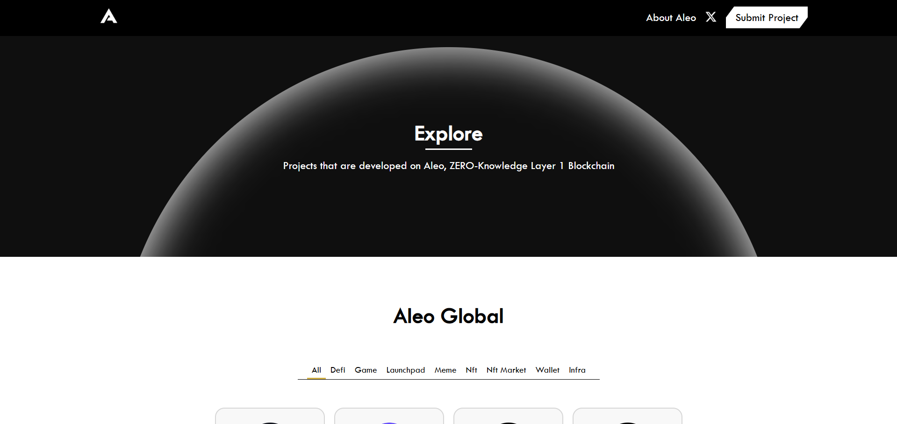
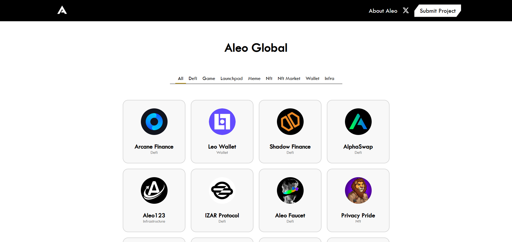
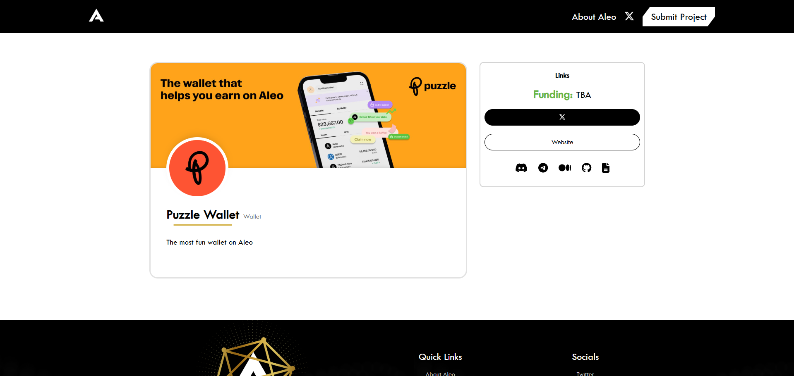

# Aleo Global

Welcome to **Aleo Global**, a simple platform showcasing projects built on the Aleo blockchain. This repository provides details on how the website operates, its purpose, and how to contribute to its ongoing development.

## About Aleo Global

Aleo Global is a web-based platform designed to:

- Display basic information about projects developed on the Aleo blockchain.
- Provide an overview of the functionality and use cases of each project.

Aleo Global serves as an accessible entry point for exploring the Aleo ecosystem, making it easy to discover and learn about innovative projects.

## Key Features

1. **Simple Project Listing**: A straightforward list of projects with minimal details.

2. **Basic Project Details**: Each project includes:
   - A short description.
   - Links to the project's website or GitHub (if available).

## Contributing

We welcome contributions to help improve Aleo Global! Here's how you can get involved:

1. **Report Issues**: Found a bug or have a suggestion? Open an issue in the GitHub repository.
2. **Submit Pull Requests**: Contribute updates or fixes by forking the repository and submitting a pull request.

### Contribution Guidelines

- Keep contributions simple and relevant to the platform.
- Provide clear commit messages and concise documentation for your updates.

## License

This project is licensed under the MIT License. See the LICENSE file for details.

## Contact

For inquiries, feedback, or support, please contact us:

- GitHub: [AleoGlobal Repository](https://github.com/MMeetJS/AleoGlobal)
- Twitter: [@Aleo\_Global](https://twitter.com/Aleo_Global)

---

Thank you for exploring Aleo Global! We hope this platform helps you navigate the Aleo ecosystem with ease.

